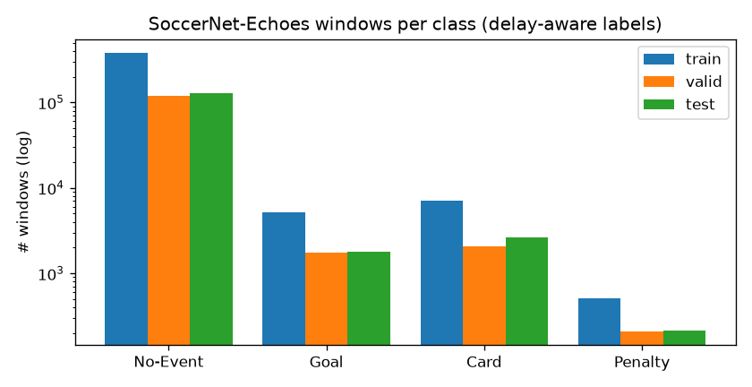
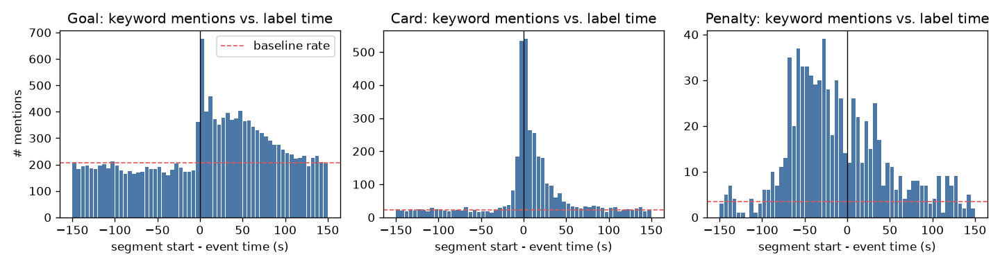
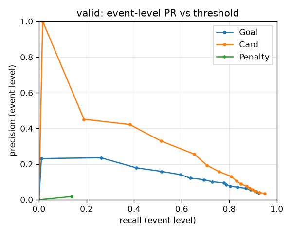
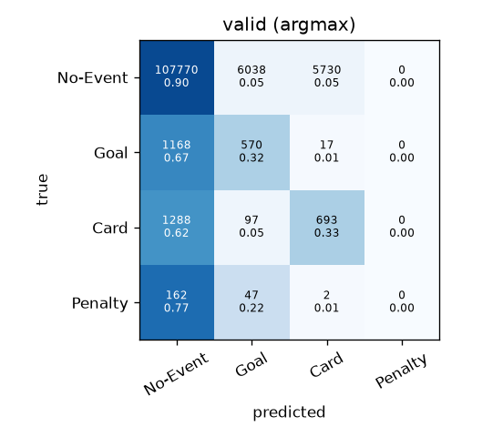

# Phát hiện sự kiện bóng đá từ lời bình luận (Commentary Event Detection)

Dự án này phát hiện **bàn thắng (Goal), thẻ phạt (Card), penalty (Penalty)** chỉ từ transcript ASR lời bình luận,
không xử lý video. Đầu ra là danh sách sự kiện `{type, timestamp, confidence}` để tự động tạo highlight.

> **Trạng thái:** pipeline đã đầy đủ và kiểm chứng trên CPU: dữ liệu, mở rộng dữ liệu, huấn luyện, đánh giá 2 mức,
> chẩn đoán precision, pipeline 2 tầng, API và Docker. Các số liệu thật đã có gồm khảo sát dữ liệu, mốc keyword rule
> và một model nhỏ train trên CPU (mục 5). **Chưa có** kết quả `xlm-roberta-base` và các cải tiến: các bước này cần
> GPU và được chạy bằng `notebooks/train_colab.ipynb` (mục 7). Bảng kết quả trong mục 5 đang để trống và sẽ điền sau
> khi chạy notebook.

## Mục lục
1. [Bài toán](#1-bài-toán)
2. [Dữ liệu và khảo sát](#2-dữ-liệu-và-khảo-sát)
3. [Repo baseline tham khảo](#3-repo-baseline-tham-khảo)
4. [Phương pháp](#4-phương-pháp)
5. [Kết quả](#5-kết-quả)
6. [Chẩn đoán precision](#6-chẩn-đoán-precision)
7. [Hướng dẫn chạy](#7-hướng-dẫn-chạy)
8. [Cấu hình huấn luyện, hyperparameter, thời gian](#8-cấu-hình-huấn-luyện-hyperparameter-thời-gian)
9. [Cấu trúc repo](#9-cấu-trúc-repo)
10. [Hạn chế và việc còn lại](#10-hạn-chế-và-việc-còn-lại)

---

## 1. Bài toán

- **Đầu vào của mỗi mẫu:** một cửa sổ transcript gồm segment hiện tại và ngữ cảnh lân cận (mặc định 1 segment
  trước, segment hiện tại, 1 segment sau = 3 segment).
- **Nhãn:** 4 lớp `No-Event`, `Goal`, `Card`, `Penalty`. `Card` gộp Yellow card, Red card và Yellow->red card.
- **Gán nhãn có tính độ trễ:** segment được gán lớp `c` nếu nó giao với khoảng `[t + delay_min, t + delay_max]` của
  một sự kiện lớp `c` tại thời điểm `t`. Độ trễ là hyperparameter, có thể đặt riêng cho từng lớp (xem mục 2.2).
- **Chia dữ liệu theo trận:** dùng split chính thức của SoccerNet-v2 (300/100/100 trận) lấy từ gói `SoccerNet`.
  Có test kiểm tra không trận nào nằm ở hai split.
- **Đánh giá 2 mức:**
  - mức đoạn: accuracy, P/R/F1 từng lớp, macro-F1, confusion matrix, F1-highlight;
  - mức sự kiện: một sự kiện được tính là bắt được nếu có dự đoán đúng lớp trong khoảng ±T giây (mặc định T = 30 s),
    ghép cặp 1-1.

## 2. Dữ liệu và khảo sát

Toàn bộ số liệu dưới đây do `scripts/survey_data.py` sinh ra (báo cáo đầy đủ ở [`docs/DATA_SURVEY.md`](docs/DATA_SURVEY.md),
số liệu thô ở `docs/data_survey.json`).

### 2.1 Các nguồn: kiểm chứng link, license và số mẫu thực tế

| Nguồn | Link | License | Truy cập | Dùng cho | No-Event | Goal | Card | Penalty |
|---|---|---|---|---|---|---|---|---|
| **SoccerNet-Echoes** (ASR Whisper v1/v2/v3 + bản dịch EN) | [SoccerNet/sn-echoes](https://github.com/SoccerNet/sn-echoes) (main @7105a85) | theo điều khoản SoccerNet (repo không ghi license riêng) | git ✅ | train/valid/test | train 378,748 · valid 119,538 · test 129,662 | 5,237 · 1,755 · 1,796 | 7,109 · 2,078 · 2,625 | 506 · 211 · 212 |
| **SoccerNet Labels-v2** (sự kiện gốc trong các trận trên) | bản mirror `summaries/*/event.json` ở nhánh [`sushant`](https://github.com/SoccerNet/sn-echoes/tree/sushant) @b3565c1; bản chính thức qua gói `SoccerNet` | SoccerNet | mirror ✅, chính thức ❌ ở cloud / ✅ Colab | nhãn | – | train 843 · valid 291 · test 296 | 1,112 · 317 · 403 | **77** · 29 · 35 |
| **SoccerNet-Caption** (mirror, gán nhãn bằng căn chỉnh với Labels-v2) | cùng nhánh `sushant` (`caption_event.json`) | SoccerNet | ✅ | chỉ train (trận train) | 17,849 | 722 | 1,044 | 71 |
| **Kaggle Football Events** (9,074 trận, 2011-2017) | [kaggle secareanualin/football-events](https://www.kaggle.com/datasets/secareanualin/football-events); mirror [DakshS07/xG_Football](https://github.com/DakshS07/xG_Football) @c477b07 | trang Kaggle không ghi license rõ ràng → chỉ dùng cho nghiên cứu | mirror ✅ (Kaggle API ❌ ở cloud) | chỉ train | 872,694 (gốc) | 24,446 | 41,163 | 2,706 |
| **Dữ liệu tổng hợp** (paraphrase giọng bình luận viên + nhiễu ASR) | tự sinh (`sed.sources.synthetic`) | – | ✅ | chỉ train | – | 1,000 | 1,000 | 3,000 |
| **Hard negatives** (7 nhóm sinh + câu khai thác từ Echoes) | tự sinh / khai thác | – | ✅ | chỉ train | 7,100 | – | – | – |
| MatchTime (căn chỉnh lại timestamp của SoccerNet-Caption) | [jyrao/MatchTime](https://github.com/jyrao/MatchTime), dữ liệu trên Google Drive | xem repo | ❌ (Drive bị chặn) | – | – | – | – | – |
| SoccerReplay-1988 | Hugging Face (gated) | xem trang dataset | ❌ (HF bị chặn) | – | – | – | – | – |

Ghi chú:
- Có 434 trận vừa có transcript vừa có nhãn (train 261 / valid 82 / test 91). Đã bỏ 66 trận không có trong mirror và
  50 trận challenge không có nhãn công khai. Đã gộp 469 nhãn Labels-v2 bị trùng (ví dụ cùng một "Goal" đánh 2 lần
  tại cùng một giây).
- **Rò rỉ dữ liệu:** SoccerNet-Caption trùng 100% số trận với SoccerNet, nên chỉ giữ caption của trận train. Kaggle
  có 208 trận trùng với SoccerNet (khớp theo ngày ±1 và tên hai đội), trong đó **89 trận thuộc valid/test đã bị loại**.
  `assemble_train` assert không có trận valid/test nào lọt vào dữ liệu ngoài.
- **Số mẫu sau khi giới hạn** (ghi trong `data/processed/manifest.json`): Kaggle được lấy tối đa 20k mẫu mỗi lớp, kèm
  số No-Event bằng tổng số mẫu dương (cấu hình `sources.kaggle`).
- Penalty là lớp hiếm nhất: chỉ có 77 sự kiện ở tập train. Vì vậy dữ liệu tổng hợp ưu tiên Penalty (3,000 mẫu).
- Ngôn ngữ (số hiệp): en 266, es 248, ru 188, de 118, fr 38, khác 10. Biến thể mặc định `auto_en` dùng bản gốc nếu
  bình luận tiếng Anh, còn lại dùng bản dịch tiếng Anh của Echoes, theo phiên bản Whisper được khuyến nghị trong
  `SN-echoes-lang.csv`.



### 2.2 Phân bố độ trễ của bình luận viên

Biểu đồ dưới đếm số lần từ khóa của lớp (goal/scores…, card/booked…, penalty/spot…) xuất hiện quanh thời điểm nhãn,
theo bin 5 s, kèm đường mức nền (đỏ):



- **Goal:** đỉnh ở [0, +5) s, sau đó vẫn cao tới khoảng +100 s (bình luận và replay sau bàn thắng). Nhãn gần như trùng
  thời điểm hô "goal".
- **Card:** đỉnh ở [-10, +5) s, vì bình luận viên nói về pha phạm lỗi và tấm thẻ trước khi trọng tài rút thẻ (nhãn).
  Khoảng hợp lý là [-15, +20] s.
- **Penalty:** từ khóa xuất hiện dày từ **-70 s đến 0 s, tức là trước nhãn**. Labels-v2 đánh nhãn Penalty ở *thời điểm
  sút*, còn bình luận viên nói về quả penalty từ lúc được thổi (khoảng 1 phút trước). Một cửa sổ chung lệch về sau
  sẽ gán sai gần hết mẫu Penalty, nên cấu hình cải tiến `imp_class_delays` dùng cửa sổ theo lớp
  `{Goal: [-5, 25], Card: [-15, 15], Penalty: [-60, 5]}`.
- Baseline dùng một cửa sổ chung `[-5, 15]` s, chọn quanh đỉnh của Goal và Card.

### 2.3 Hard negatives tự nhiên và nhiễu nhãn

- Tập train có 33,148 cửa sổ No-Event chứa từ "goal" và 2,774 cửa sổ chứa "penalty" (thường là "penalty area",
  "goal kick", nhắc bàn thắng cũ). Đây chính là nguồn false positive (mục 6). Khi giảm mẫu âm, các cửa sổ này
  **luôn được giữ lại**.
- Có 7 trận mà số nhãn `Goal` khác tỉ số trong tên trận (ví dụ *Real Madrid 4 - 2 Bayern* chỉ có 3 nhãn Goal).
  Các câu "What a goal Barça have just scored…" đôi khi rơi vào No-Event do cửa sổ độ trễ, đây là nhiễu nhãn. Vì vậy
  hard negatives khai thác từ Echoes chỉ lấy những câu cách mọi sự kiện cùng lớp hơn 120 s.

## 3. Repo baseline tham khảo

Tôi đã tìm repo **"Event-Detection"** trên SoccerNet-Echoes (`xlm-roberta-base`, cửa sổ 3 segment, có tính độ trễ,
accuracy ≈ 72.4 %, F1-highlight ≈ 0.67) qua tìm kiếm web, tổ chức GitHub SoccerNet, các nhánh của `sn-echoes`
(nhánh `sushant` chỉ có code tóm tắt trận/embedding) và các repo liên quan như MatchTime và soccer-rag, nhưng
**không tìm thấy repo công khai nào khớp mô tả**. Vì vậy pipeline được **cài đặt lại từ đầu theo mô tả trong
TASK.md**:
`configs/base.yaml` = `xlm-roberta-base`, cửa sổ 1+1+1 segment, nhãn có độ trễ, 5 epoch, fp16, lr 2e-5.

Mốc 72.4 % / 0.67 gần như chắc chắn được đo trên một tập **cân bằng lớp**: trên phân bố tự nhiên có khoảng 97 % cửa sổ
là No-Event, nên một model luôn đoán No-Event đã đạt accuracy 97 %. Vì vậy mỗi lần đánh giá đều báo thêm
`segment_balanced_argmax` (toàn bộ mẫu dương + số mẫu âm ngẫu nhiên bằng số mẫu dương) để so sánh được với mốc này,
bên cạnh số liệu trên phân bố tự nhiên và số liệu mức sự kiện.

## 4. Phương pháp

```
sn-echoes (ASR) ─┐                    ┌─ echoes_{train,valid,test}.jsonl ──┐
Labels-v2 ───────┼─ align (delay) ────┤                                    ├─ train (+ external, train only)
Caption/Kaggle ──┤  windows, split    └─ caption/kaggle/synthetic/hardneg ─┘        │
LLM/template ────┘                                                     xlm-roberta-base (fp16)
                                                                                  │ probs per segment
             smoothing → per-class thresholds (tuned on valid) → temporal NMS → events {type, t, conf}
                                         │                                        │
                              stage 2 verifier (larger model / LLM)       event-level metrics, FP diagnosis
```

- **Pipeline dữ liệu** (`sed.data`): `download` (sparse clone, ghim commit), `echoes` (đọc ASR; một số file dịch có
  key bị dịch luôn, ví dụ "eleven", nên sắp xếp theo thời gian), `soccernet_labels` (Labels-v2 chính thức hoặc
  mirror, gộp nhãn trùng), `align` (gán nhãn có độ trễ, đo độ trễ), `windows`, `splits`, `prepare` (ghi file sạch
  `.jsonl` và manifest).
- **Mở rộng dữ liệu** (`sed.sources`), mọi mẫu đều có trường `source` và `meta` để truy vết và làm ablation:
  - *Caption:* gán nhãn caption bằng căn chỉnh: caption đầu tiên (ưu tiên caption có từ khóa) trong [t-10, t+90] s
    sau một sự kiện. Bỏ tỉ số ("GOAL 0:1!"), tách câu thành dạng cửa sổ.
  - *Kaggle:* bỏ các dấu hiệu khuôn mẫu lộ nhãn ("Goal!", "Booking", "is shown the yellow card", "Penalty conceded
    by", "draws a foul in the penalty area"…), tỉ số và từ khóa nhãn; chuẩn hoá về dạng ASR. Chỉ dùng cho train.
  - *Tổng hợp:* sinh cửa sổ 3 phần (trước / lúc xảy ra / phản ứng) theo giọng bình luận viên rồi thêm nhiễu ASR
    (bỏ dấu câu, đảo ký tự, rơi từ, đồng âm "goal→gold", câu bị cắt). Có 3 backend: `template` (offline),
    `hf` (Qwen2.5-1.5B-Instruct trên T4) và `anthropic` (Claude API, model mặc định `claude-opus-5-5`). Seed là các
    cửa sổ sự kiện thật của trận train và caption train.
  - *Hard negatives:* 7 nhóm (replay, nhắc sự kiện cũ, suýt ghi bàn, "lẽ ra phải là thẻ/penalty", thống kê, goal
    kick/penalty area, bàn thắng bị huỷ), cộng câu khai thác từ Echoes như ở mục 2.3.
- **Mô hình:** `AutoModelForSequenceClassification`. Cách mã hoá cửa sổ là `[CLS] trước [SEP] HIỆN TẠI [SEP] sau [SEP]`,
  không bao giờ cắt segment hiện tại trước. Vòng huấn luyện viết bằng PyTorch thuần (AdamW, warmup tuyến tính,
  fp16 autocast, clip grad 1.0). Mỗi epoch đánh giá trên valid (toàn bộ mẫu dương + 30k mẫu âm) và chọn checkpoint
  theo F1-highlight. `tiny-local` là một BERT nhỏ khởi tạo ngẫu nhiên cùng tokenizer tự train, chỉ dùng để test
  offline.
- **Mất cân bằng lớp:** giảm mẫu âm khi train (giữ 4 mẫu âm cho mỗi mẫu dương, luôn giữ hard negatives), CE có trọng
  số (nghịch đảo căn bậc hai tần suất), focal loss, sampler cân bằng.
- **Hậu xử lý** (`sed.postprocess`): làm mượt xác suất theo thời gian, ngưỡng riêng từng lớp được **tune trên valid**
  để tối đa F1 mức sự kiện, **NMS theo thời gian** (gộp các dự đoán cùng lớp trong vòng 30 s thành 1 sự kiện), rồi
  quy đổi thời điểm sự kiện = thời điểm segment − độ trễ kỳ vọng của lớp.
- **Pipeline 2 tầng** (`sed.two_stage`): tầng 1 dùng ngưỡng thấp nhất sao cho recall sự kiện trên valid ≥ 0.9; tầng 2
  xác minh từng ứng viên bằng một run khác (model lớn hơn hoặc ngữ cảnh rộng hơn, lấy trung bình nhân hai xác suất,
  ngưỡng tune trên valid) hoặc bằng một LLM đọc ±4 segment và trả lời "sự kiện có xảy ra *ngay lúc này* không".
- **Service** (`sed.service.app`): FastAPI `POST /detect` và `GET /health`, có Dockerfile chạy trên CPU.

## 5. Kết quả

### 5.1 Số liệu thật đã chạy trên CPU (cloud không có GPU)

Tập valid/test là toàn bộ cửa sổ ASR thật của SoccerNet-Echoes, ở phân bố tự nhiên. Ngưỡng sự kiện T = ±30 s.

| Run | Tập | seg acc | seg F1-highlight | bal acc | bal F1-highlight | sự kiện P | sự kiện R | sự kiện F1 | F1 Goal / Card / Penalty |
|---|---|---|---|---|---|---|---|---|---|
| keyword rule (`scripts/keyword_baseline.py`) | valid | 0.878 | 0.084 | 0.538 | 0.263 | 0.074 | 0.804 | 0.136 | 0.087 / 0.518 / 0.045 |
| keyword rule | test | 0.871 | 0.077 | 0.527 | 0.239 | 0.071 | 0.753 | 0.130 | 0.076 / 0.504 / 0.056 |
| `cpu_tiny` (BERT nhỏ 2 lớp khởi tạo ngẫu nhiên, train 3 epoch trên CPU, 17.6 phút) | valid | 0.882 | 0.147 | 0.609 | 0.431 | 0.219 | 0.424 | **0.289** | 0.228 / 0.401 / 0.016 |
| `cpu_tiny` | test | 0.900 | 0.160 | 0.601 | 0.400 | 0.261 | 0.443 | **0.328** | 0.222 / 0.464 / 0.033 |

Chi tiết (metrics.json, đường PR, confusion matrix, ví dụ FP) nằm ở [`docs/results/`](docs/results/).

 

- Keyword rule bắt được 80 % sự kiện nhưng precision chỉ 7 %. Đây đúng là bức tranh "precision thấp" mà TASK.md nêu.
- **Riêng NMS** với keyword rule đã giảm FP mức sự kiện từ 12,033 xuống 6,362, gần như không mất TP (526 → 512).
  Nhiều "false positive" thực chất là cùng một sự kiện bị báo ở nhiều cửa sổ liền nhau.
- Một transformer rất nhỏ, không pretrain, train trên CPU, đã **gấp đôi F1 mức sự kiện so với keyword rule**
  (valid 0.136 → 0.289, test 0.130 → 0.328), nhờ phân biệt được phần nào bình luận "đang xảy ra" với replay.
  Precision vẫn thấp (0.22). Chuỗi hậu xử lý cho tác dụng rõ: argmax không NMS cho P 0.036 / R 0.744 với 12,720 FP;
  thêm ngưỡng tune được 3,469 FP; thêm NMS còn **964 FP** (P 0.219 / R 0.424).
- **Penalty gần như không học được** (F1 0.016) với cửa sổ độ trễ chung [-5, 15] s. Điều này khớp với phân tích ở
  mục 2.2 (bình luận về penalty diễn ra *trước* nhãn khoảng 1 phút) và là lý do cho cải tiến `imp_class_delays`
  cùng dữ liệu tổng hợp ưu tiên Penalty.
- Các số này chứng minh pipeline chạy và học được trên dữ liệu thật. Chúng **không phải** kết quả của baseline
  xlm-roberta (`configs/cpu_tiny.yaml`).

### 5.2 Bảng so sánh baseline và các cải tiến (điền sau khi chạy notebook Colab)

Quy ước cột như trên, đo trên valid (ngưỡng tune trên valid); `test_evt_f1` đo trên test.
`scripts/run_experiments.py` tự sinh bảng này vào `outputs/results.md`.

| Run | Thay đổi so với baseline | seg acc | seg F1-hl | bal acc | bal F1-hl | evt P | evt R | evt F1 | test evt F1 |
|---|---|---|---|---|---|---|---|---|---|
| mốc công bố (repo gốc) | – | 0.724* | 0.67* | | | | | | |
| `baseline` = `data_echoes` | xlm-roberta-base, Echoes | _TBD_ | | | | | | | |
| `data_caption` | + SoccerNet-Caption | _TBD_ | | | | | | | |
| `data_kaggle` | + Kaggle (đã che từ khóa) | _TBD_ | | | | | | | |
| `data_synthetic` | + tổng hợp | _TBD_ | | | | | | | |
| `data_hardneg` | + hard negatives | _TBD_ | | | | | | | |
| `data_all` | + tất cả | _TBD_ | | | | | | | |
| `imp_weighted_ce` | CE có trọng số | _TBD_ | | | | | | | |
| `imp_focal` | focal loss | _TBD_ | | | | | | | |
| `imp_class_delays` | cửa sổ độ trễ theo lớp (chỉ so mức sự kiện) | _TBD_ | | | | | | | |
| `imp_context5` | ngữ cảnh 2+1+2 | _TBD_ | | | | | | | |
| `imp_mdeberta` | mdeberta-v3-base | _TBD_ | | | | | | | |
| `imp_xlmr_large` | xlm-roberta-large | _TBD_ | | | | | | | |
| `imp_smoothing` | làm mượt 3 + NMS 45 s | _TBD_ | | | | | | | |
| two-stage | baseline + verifier xlmr-large | _TBD_ | | | | | | | |
| `final` | kết hợp các hướng có lợi | _TBD_ | | | | | | | |

\* đo trên tập của repo gốc (nhiều khả năng là tập cân bằng); so với cột `bal`.

## 6. Chẩn đoán precision

Mỗi FP mức sự kiện được xếp vào một nhóm (`sed.diagnose`): `duplicate` (cùng sự kiện bị báo 2 lần), `time_offset`
(đúng sự kiện nhưng lệch hơn T giây), `wrong_class`, `replay_recall` (replay hoặc nhắc sự kiện cũ), `keyword_no_event`
(có từ khóa nhưng không có sự kiện: hard negative hoặc nhãn bị thiếu), `other`. Kết quả với keyword rule trên valid:

| nhóm FP | số lượng | tỉ lệ |
|---|---|---|
| replay_recall | 2,854 | 44.9 % |
| keyword_no_event | 2,577 | 40.5 % |
| time_offset | 586 | 9.2 % |
| wrong_class | 244 | 3.8 % |
| duplicate (sau NMS) | 101 | 1.6 % |

Từ đó rút ra các biện pháp, đều đã cài đặt và có trong ablation:
1. NMS theo thời gian và làm mượt để xử lý FP do lặp lại;
2. hard negatives nhóm replay, nhắc lại, suýt ghi bàn và "lẽ ra phải là thẻ" để xử lý `replay_recall` và
   `keyword_no_event`;
3. cửa sổ độ trễ theo lớp để xử lý `time_offset` (đặc biệt cho Penalty);
4. tầng 2 xác minh với ngữ cảnh rộng hơn để phân biệt "đang xảy ra" với "đang nhắc lại".

Mỗi run cũng lưu đường precision–recall theo ngưỡng cho từng lớp (`pr_curves_valid.png`), confusion matrix,
và ví dụ FP trong `metrics.json → valid.fp_diagnosis.examples`.

## 7. Hướng dẫn chạy

### 7.1 Cài đặt
```bash
pip install -e ".[serve,dev]"        # Python ≥ 3.10; torch được cài từ PyPI nếu chưa có
```

### 7.2 Smoke test toàn pipeline trên CPU (một lệnh, khoảng 3 phút)
```bash
bash scripts/smoke_test.sh
```
Lệnh này lần lượt chạy pytest, tải dữ liệu (nếu chưa có, khoảng 900 MB), chuẩn bị dữ liệu (3 trận mỗi split + mọi
nguồn ngoài), train model tiny 200 bước, đánh giá 2 mức, pipeline 2 tầng, suy luận bằng CLI, và gọi HTTP API qua
uvicorn.

### 7.3 Pipeline đầy đủ
```bash
python -m sed.data.download --root data/raw [--official]   # --official: thêm Labels-v2 chính thức (cần mạng tới SoccerNet)
python scripts/survey_data.py                                # docs/DATA_SURVEY.md + biểu đồ
python scripts/prepare_data.py                               # data/processed/*.jsonl + manifest.json
python scripts/keyword_baseline.py                           # mốc không dùng mạng nơ-ron
python -m sed.train --config configs/base.yaml               # baseline (GPU)
python scripts/run_experiments.py configs/ablation/*.yaml    # ablation, tự sinh outputs/results.md
python -m sed.two_stage --config outputs/baseline/config.yaml --stage1 outputs/baseline \
       --verifier model:outputs/imp_xlmr_large               # hoặc --verifier llm:hf:Qwen/Qwen2.5-1.5B-Instruct
```
Mọi tham số đều override được từ CLI, ví dụ `python -m sed.train --config configs/base.yaml train.lr=3e-5 data.ctx_before=2`.
Seed cố định là `seed: 42` (Python, NumPy, torch, DataLoader generator, việc giảm mẫu âm và chia hash).

Sinh dữ liệu tổng hợp bằng LLM:
`python scripts/prepare_data.py --sources synthetic hardneg sources.synthetic.backend=hf`
(hoặc `backend=anthropic`, cần `pip install anthropic` và `ANTHROPIC_API_KEY`).

### 7.4 Colab
Mở `notebooks/train_colab.ipynb` trên Colab với GPU T4 rồi chạy từ trên xuống. Notebook clone repo, cài đặt, tải dữ
liệu, chạy khảo sát, chuẩn bị dữ liệu, smoke test, keyword rule, baseline, ablation, cải tiến, 2 tầng, final, in bảng
kết quả rồi zip kết quả lên Drive. Biến `RUN_SET="core"` (khoảng 3.5 giờ) hoặc `"full"` (khoảng 7 giờ). Các run đã
xong sẽ được bỏ qua khi chạy lại.

### 7.5 Service suy luận
```bash
# local
MODEL_DIR=outputs/baseline/best uvicorn sed.service.app:app --port 8000
# docker
docker build -t sed-api .
docker run --rm -p 8000:8000 -v $PWD/outputs/baseline/best:/model sed-api
# gọi API (examples/request.json: 70 segment quanh bàn thắng của Aguero, Man City 3-0 Chelsea, tập test)
curl -s -X POST localhost:8000/detect -H 'Content-Type: application/json' -d @examples/request.json
python examples/client.py --url http://localhost:8000 --transcript examples/request.json
```
Request:
```json
{"segments": [{"start": 1859.0, "end": 1861.0, "text": "Aguero, can he take this one? He does!", "half": 1}, ...],
 "thresholds": {"Goal": 0.6},  "min_confidence": 0.0}
```
Response thật từ model `cpu_tiny` (`examples/response_example.json`). Bàn thắng thật ở 1860 s được bắt tại
1857 s; sự kiện thứ hai là một FP kiểu "bình luận lại sau bàn thắng":
```json
{"events": [
  {"type": "Goal", "timestamp": 1857.0, "confidence": 0.7799, "half": null,
   "segment": {"start": 1862.0, "end": 1864.0, "text": "If at first you don't succeed..."}},
  {"type": "Goal", "timestamp": 1954.0, "confidence": 0.7241, "half": null,
   "segment": {"start": 1959.0, "end": 1962.0, "text": "There's just absolutely no need off the back of going 1-0 up."}}],
 "n_segments": 70, "model": "outputs/cpu_tiny/best (tiny CPU model, illustration only)", "latency_ms": 56.3}
```
`half` là tuỳ chọn; nếu gửi cả trận, mỗi hiệp được xử lý riêng (thời gian bắt đầu lại từ 0).
`timestamp` là thời điểm ước lượng của sự kiện, tính bằng giây trong hiệp, đã trừ độ trễ bình luận kỳ vọng của lớp.
Ngưỡng, độ trễ, làm mượt và NMS được đọc từ `sed_inference.json`, file này được ghi vào checkpoint khi đánh giá.

## 8. Cấu hình huấn luyện, hyperparameter, thời gian

| Tham số | Baseline | Lý do |
|---|---|---|
| backbone | `xlm-roberta-base` | theo repo tham khảo; đa ngôn ngữ (một phần transcript vẫn chưa dịch) |
| cửa sổ | 1 + 1 + 1 segment, `max_length` 128 | theo repo tham khảo; 3 segment ≈ 4–8 s ≈ 30–60 token, nên 128 là đủ |
| độ trễ nhãn | [-5, +15] s, chung cho mọi lớp | quanh đỉnh của Goal/Card trong biểu đồ độ trễ (mục 2.2) |
| epoch / batch / lr | 5 / 32 / 2e-5, warmup 6 %, wd 0.01, fp16 | công thức chuẩn khi fine-tune RoBERTa; 5 epoch theo repo tham khảo |
| mẫu âm khi train | 4 mẫu âm mỗi mẫu dương, giữ mọi hard negative | phân bố tự nhiên có 97 % âm; giảm mẫu để train nhanh 5 lần, ngưỡng tune trên valid bù lại; `imp_all_negatives` kiểm tra lựa chọn này |
| chọn checkpoint | F1-highlight trên valid (toàn bộ mẫu dương + 30k mẫu âm) | không nhìn test |
| hậu xử lý | ngưỡng tune trên valid, NMS 30 s, T = 30 s | dự đoán liền nhau cách nhau dưới 30 s thường là cùng một sự kiện |

Thời gian ước tính trên Colab T4 (fp16, padding động): baseline có khoảng 64k mẫu train, khoảng 2k bước mỗi epoch,
mất khoảng 2.5–3 phút mỗi epoch; cộng đánh giá đầy đủ valid và test (khoảng 250k cửa sổ, 3–4 phút), tổng cộng khoảng
**20 phút**. `data_kaggle` / `data_all` mất khoảng 40 phút. `imp_mdeberta` mất khoảng 35 phút (fp32). `imp_xlmr_large`
mất khoảng 60 phút (3 epoch). Đây là ước tính, sẽ cập nhật khi có `train_time_min` thật trong `summary.json`.
Đã đo thật: `cpu_tiny` mất 17.6 phút train trên CPU 4 nhân; `smoke.yaml` mất khoảng 1–2 phút; image Docker đã được
build và chạy thử bằng `docker run` trong môi trường này.

## 9. Cấu trúc repo

```
configs/            base.yaml (baseline), smoke.yaml, cpu_tiny.yaml, final.yaml, ablation/*.yaml
src/sed/data/       download, echoes, soccernet_labels, align, windows, splits, build, prepare
src/sed/sources/    caption, kaggle_events, synthetic (+ hard negatives), text_utils (ASR noise, masking)
src/sed/model/      encoding, factory (HF / tiny-local), losses (weighted CE, focal), predict
src/sed/            train, evaluate, metrics, postprocess, diagnose, two_stage, infer, config, labels
src/sed/service/    FastAPI app
scripts/            survey_data, prepare_data, keyword_baseline, run_experiments, smoke_test.sh, make_notebook
notebooks/          train_colab.ipynb (sinh bởi scripts/make_notebook.py)
docs/               DATA_SURVEY.md, data_survey.json, figures/
examples/           request.json, response_example.json, client.py
tests/              căn chỉnh nhãn, cửa sổ, chia theo trận, nguồn dữ liệu, metric, hậu xử lý, encoding, API
```
Dữ liệu (`data/`), checkpoint và `outputs/` không được commit (xem `.gitignore`).

## 10. Hạn chế và việc còn lại

- **Chưa có kết quả GPU:** baseline xlm-roberta, ablation, cải tiến và 2 tầng phải chạy bằng notebook Colab.
  Bảng 5.2 đang để trống.
- Repo baseline gốc không tìm thấy, nên mốc 72.4 % / 0.67 không tái hiện được trên cùng tập đánh giá. Cột `bal_*`
  chỉ là phép so sánh gần đúng.
- Labels-v2 lấy từ mirror (434/500 trận, độ phân giải 1 s, không có trường `visibility`). Trên Colab có thể dùng
  `--official` để lấy bản chính thức; khi đó `label_source: auto` sẽ ưu tiên bản chính thức.
- MatchTime và SoccerReplay-1988 không truy cập được từ môi trường cloud (Google Drive và HF bị chặn), nên chưa tích
  hợp. Loader caption đã hỗ trợ định dạng `Labels-caption.json` chính thức.
- Dữ liệu tổng hợp trong repo được sinh bằng backend `template`. Bản LLM (`hf`/`anthropic`) đã cài đặt nhưng chưa
  chạy ở đây vì không có GPU/API key.
- Trên CPU chỉ dùng được backbone `tiny-local`, vì HF Hub bị chặn trong môi trường cloud.

### Trích dẫn dữ liệu
SoccerNet-Echoes (Gautam et al., 2024), SoccerNet-v2 (Deliège et al., 2021), SoccerNet-Caption (Mkhallati et al., 2023),
Kaggle Football Events (Secareanu, 2017). Dữ liệu chỉ được tải về khi chạy, không phân phối lại trong repo, trừ một đoạn
transcript ngắn làm ví dụ trong `examples/request.json`.
